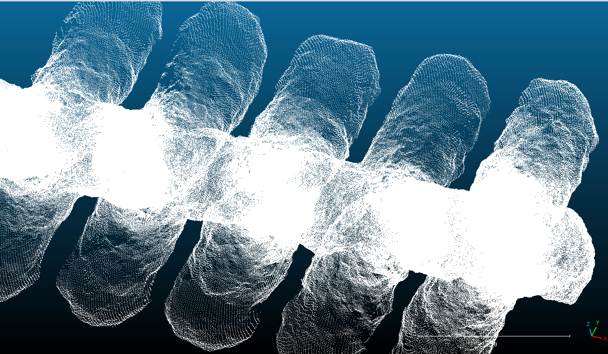

# CPP version

## Building

```bash
cd PureCpp
mkdir build 
cmake -B build
make -C build
```

## Running

The following command
```bash
./build/tunNetGen
```

You can use the help for more configuration
```bash
./build/tunNetGen --help
```

The point cloud generated should yield to this

