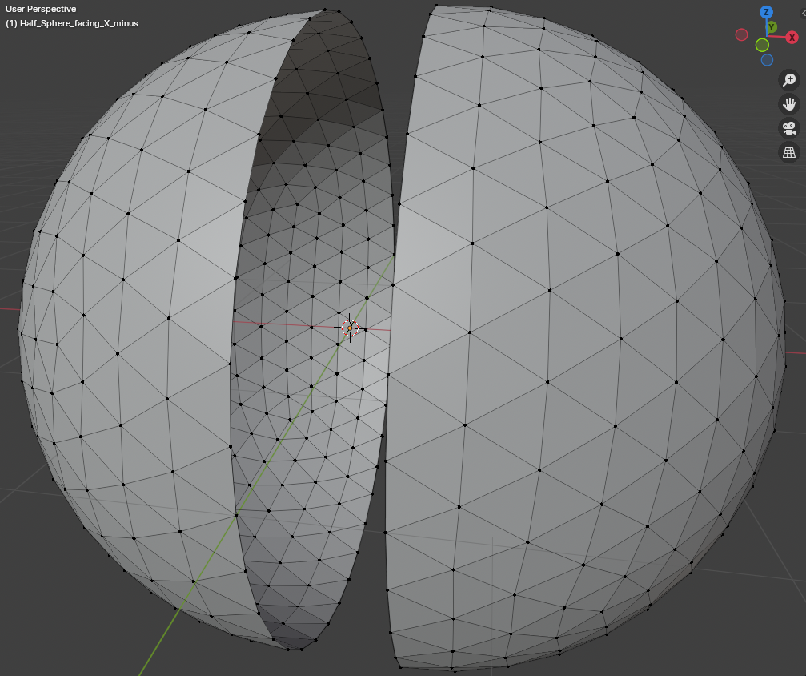
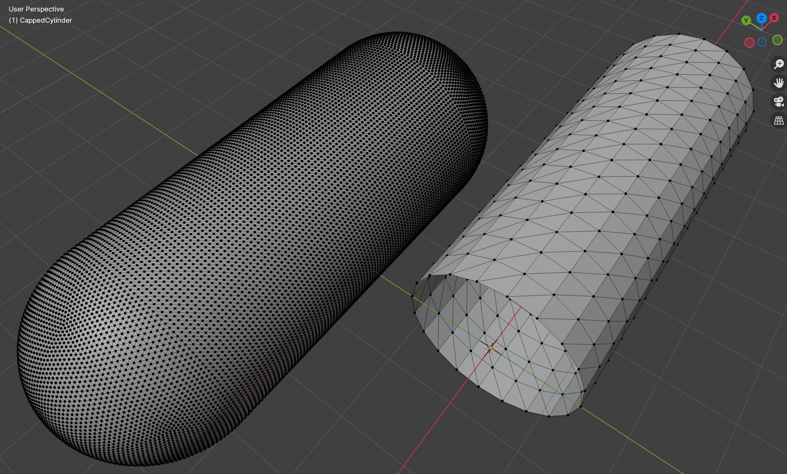
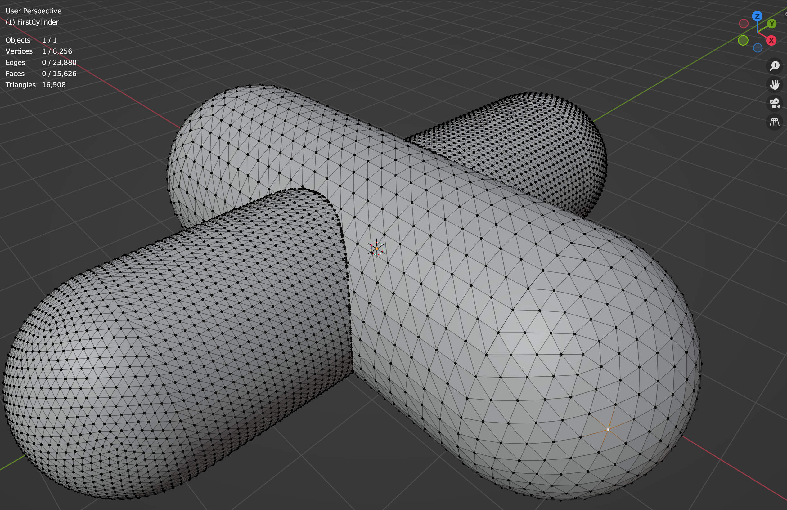
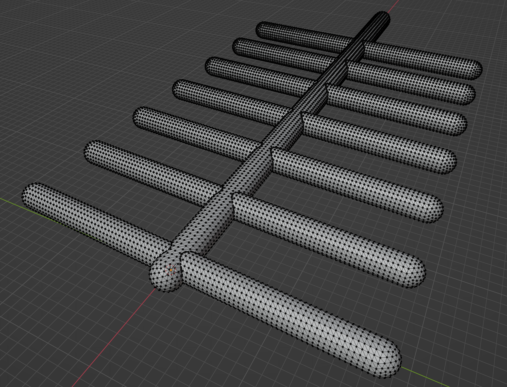

# Python API of Blender (bpy) generated geometries

<!-- TOC -->

- [Installation](#installation)
- [Interacting with the resulting geometries](#interacting-with-the-resulting-geometries)
- [Running the examples](#running-the-examples)
  - [A capped cylinder](#a-capped-cylinder)
  - [Two intersecting capped cylinders](#two-intersecting-capped-cylinders)
  - [A small set of intersecting cylinders](#a-small-set-of-intersecting-cylinders)
- [Blender tricks](#blender-tricks)
- [References](#references)
- [Modeling notes](#modeling-notes)
- [Issues](#issues)
  - [Why is it required for PYTHONPATH to point to the virtual environnement](#why-is-it-required-for-pythonpath-to-point-to-the-virtual-environnement)

<!-- /TOC -->

## Installation

```bash
python3.10 -m venv venv
source venv/bin/activate
(venv) pip install -r requirements.txt
```

Then running a script is the traditional invocation e.g.

```bash
(venv) python cylinder_example.py -v --subdivision 5
```

## Interacting with the resulting geometries

If you wish to interact with the resulting geometries with the help of the
blender UI (that is use commands of the form `blender --python <some_script.py>`),
and because of 
[this issue](#why-is-it-required-for-pythonpath-to-point-to-the-virtual-environnement),
you will further need to define the following `PYTHONPATH` environnement 
variable

```bash
(venv) export PYTHONPATH=`pwd`:`pwd`/venv/lib/python3.10/site-packages
```

Using Blender UI with the constructed is achieved with e.g (**mind the 
additional " -- " argument**)

```bash
blender --python cylinder_example.py -- -v --subdivision 4
```

## Running the examples

Here is a list of some examples

```bash
blender --python UI_half_sphere.py
```


### A capped cylinder


### Two intersecting (capped) cylinders
With the Blender UI
```bash
blender --python two_intersecting_cylinders_example.py -- --radius 1.5 --length 6.0 --subdivision 4
```

should yield something like



In headless mode (without the Blender UI) the "two intersecting cylinders" 
example translates to 

```bash
python two_intersecting_cylinders_example.py --radius 1.5 --length 6.0 --subdivision 5
```

In both cases (with/without the UI) two files using a `PLY` format are created
(use the `--outputdir` flag to modify the output directory, refer to the usage
`python two_intersecting_cylinders_example.py --help`).

**Caveat emptor**: Blender boolean "union" operator that is used under the hood
for intersecting triangles appear to be quite sensible-to/dependent-on the 
geometry its mesh inputs. This weakness becomes numerically apparent because 
the examples assert the resulting topology (as opposed to a simple visual 
check for which the result seems correct yet not water-tight).
For example Blender union operator is not that robust with
 - "high" resolution meshes (that is with a "large" number of triangles),
 - arbitrary geometrical positions that do not "suit" the algorithm.

As a consequence and depending on the input parameters 
`two_intersecting_cylinders_example.py` often fails. For example a 
`--subdivision` value bigger than 6 makes things fail...

Here is a short list of working examples, that should work for subdivision 
values in the `[2, 6]` range:
- `python two_intersecting_cylinders_example.py --radius 0.4 --length 2.0 --subdivision 5`
- `python two_intersecting_cylinders_example.py --radius 0.75 --length 4.0 --subdivision 5`
- `python two_intersecting_cylinders_example.py --radius 0.75 --length 6.0 --subdivision 5`
- `python two_intersecting_cylinders_example.py --radius 1.5 --length 6.0 --subdivision 3`
- ...


### A small set of intersecting cylinders
Additionally
```bash
blender --python UI_a_couple_of_cylinders.py  
```
should yield something like
 

## Blender tricks

* [Increase vertices to a cylinder](https://blender.stackexchange.com/questions/193384/i-want-to-increase-the-number-of-vertices-in-a-cylinder)
* [Deleting faces](https://www.youtube.com/watch?v=At23FTDEu7E): select the face and use the `x` key
* [Selecting the edge loops](https://docs.blender.org/manual/en/2.79/modeling/meshes/selecting/edges_faces.html) (that is edges on the boundary of a surface)
* Showing the [number of selected primitives](https://blender.stackexchange.com/questions/145032/the-number-of-objects-selected) (vertices, edges, faces):
 go in the 3D Viewport to the top right under Viewport Overlays (icon is an open circle intersecting a closed circle) and enable the Statistics checkbox.

## References
* [bmesh module operations documentation](https://docs.blender.org/api/current/bmesh.ops.html)
* [Exporting bmesh to PLY](https://blenderartists.org/t/mesh-to-point-cloud/1124144/29)
* [edge/face loops using python](https://blenderartists.org/t/how-do-i-work-with-edge-face-loops-using-python/1228205/2)
* [Bmesh structure design](https://wiki.blender.org/wiki/Source/Modeling/BMesh/Design#Connectivity_Cycles)
* [Shaping Models With BMesh](https://behreajj.medium.com/shaping-models-with-bmesh-in-blender-2-9-2f4fcc889bf0)

## Modeling notes

## Issues

### Why is it required for PYTHONPATH to point to the virtual environnement

The reasons for having to define the `PYTHONPATH` environnement variable are
probably [hinted/documented in this blender stackexchange thread](https://blender.stackexchange.com/questions/181928/does-blender-use-a-python-virtual-environment). 
The difficulty can be simply illustrated with the following set of commands

```bash
(venv) export PYTHONPATH='pure junk'     # Just making sure it is not set
(venv) python -c "import bpyhelpers"     # OK
(venv) echo "import bpyhelpers" > script.py
(venv) blender --python script.py        # FAILS with
  [...]
  File "<somepath>/script.py", line 1, in <module>
    import bpyhelpers
  ModuleNotFoundError: No module named 'bpyhelpers'
```

